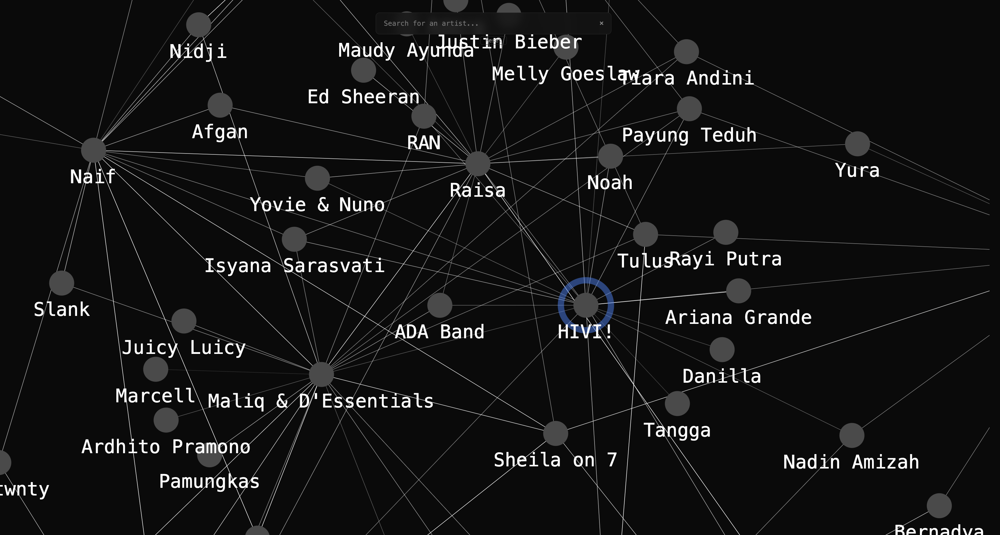

# Similar Artists Graph

An open-source artist similarity graph engine with an interactive React viewer. Explore music relationships through a force-directed graph powered by multiple live APIs.



## What It Does

Type an artist name and instantly explore their musical neighborhood as an interactive graph. Each node represents an artist, edges show similarity relationships, and you can click any artist to expand their connections recursively. The engine aggregates data from 6+ music platforms (MusicBrainz, ListenBrainz, Last.fm, Deezer, TasteDive, Spotify) to build a rich, cross-platform view of artist relationships.

## Features

- **Multi-provider data aggregation** — Combines similarity data from 6 music APIs with intelligent deduplication
- **Interactive force-directed graph** — Zoom, pan, drag, and click-to-expand exploration
- **Cross-platform metadata** — Artist images, genres, popularity, and external links from multiple sources
- **Smart identity resolution** — Uses MusicBrainz IDs as canonical anchors with fuzzy name matching
- **Rate-limit aware** — Automatic request queuing, backoff, and caching
- **Export capabilities** — Save graphs as JSON or GEXF (Gephi-compatible)
- **Standalone engine package** — Use `@similar-artists-graph/engine` in Node.js or browser projects
- **Next.js ready** — Viewer components are SSR-safe and individually exportable

## Quick Start

```bash
# Install dependencies
pnpm install

# Start the viewer (localhost:5173)
pnpm dev

# Build all packages
pnpm build

# Run tests
pnpm test
```

## Architecture

This is a pnpm workspace monorepo with two packages:

- **`packages/engine`** — Core graph engine (TypeScript, tsup, ESM+CJS)
- **`packages/viewer`** — React viewer app (Vite, react-force-graph-2d, Zustand)

The engine is provider-agnostic and uses a `Result<T,E>` pattern for error handling. All providers implement a common interface with injectable dependencies (cache, queue, fetch).

## Packages

### `@similar-artists-graph/engine`

| Package | Description |
|---|---|
| `graphology` | Graph data structure library |
| `graphology-traversal` | Graph traversal utilities |
| `p-queue` | Promise queue with concurrency control |
| `string-similarity` | Fuzzy string matching for artist name deduplication |

Dev dependencies: `tsup`, `typescript`, `vitest`, `@types/node`, `graphology-types`

### `@similar-artists-graph/viewer`

| Package | Description |
|---|---|
| `react` | UI library (v19) |
| `react-dom` | React DOM renderer |
| `react-force-graph-2d` | 2D force-directed graph canvas renderer |
| `zustand` | Lightweight state management |
| `d3-force` | Force simulation for graph layout |
| `d3-scale-chromatic` | Color scales for node styling |
| `sonner` | Toast notification library |

Dev dependencies: `vite`, `@vitejs/plugin-react`, `vitest`, `typescript`, `jsdom`, `@testing-library/react`, `vitest-canvas-mock`

## Requirements

- Node.js ≥20.19.0
- pnpm (package manager)
- API keys (optional): Last.fm, Deezer, TasteDive, Spotify

## License

MIT
